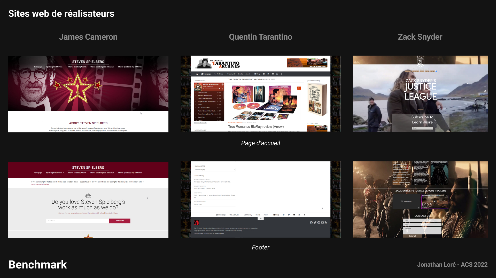
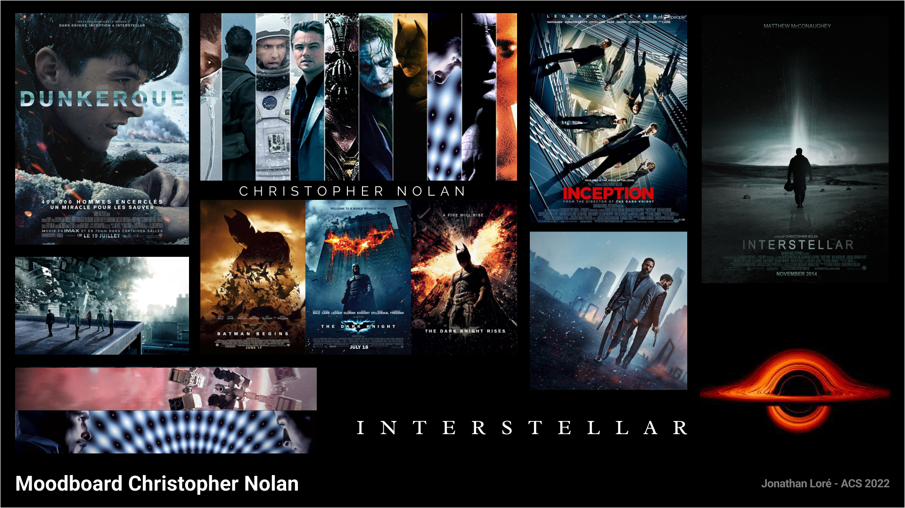
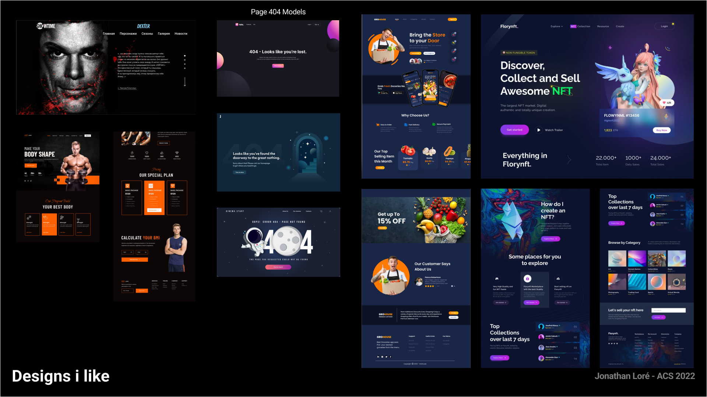
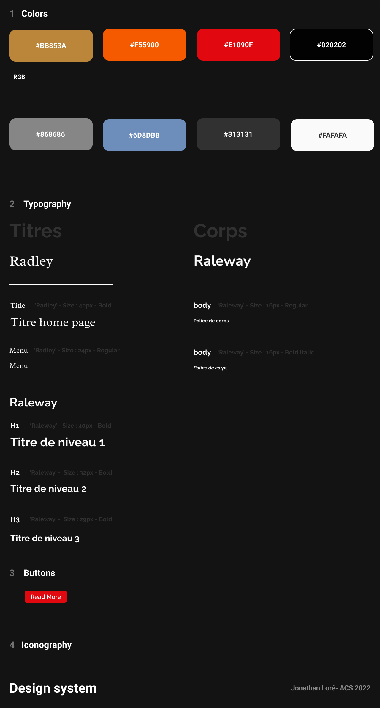
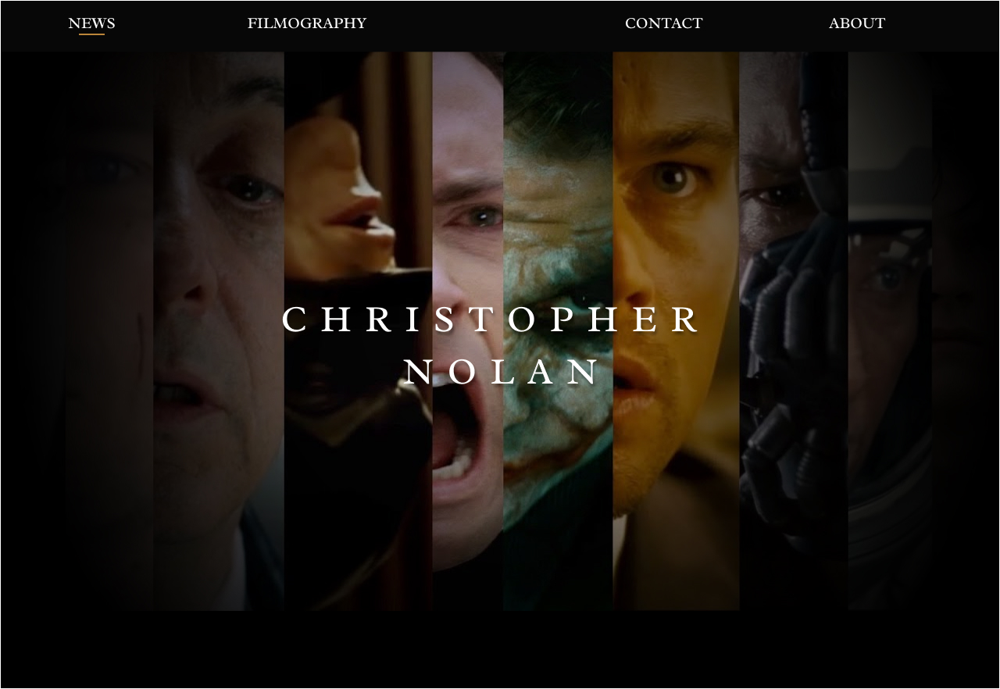
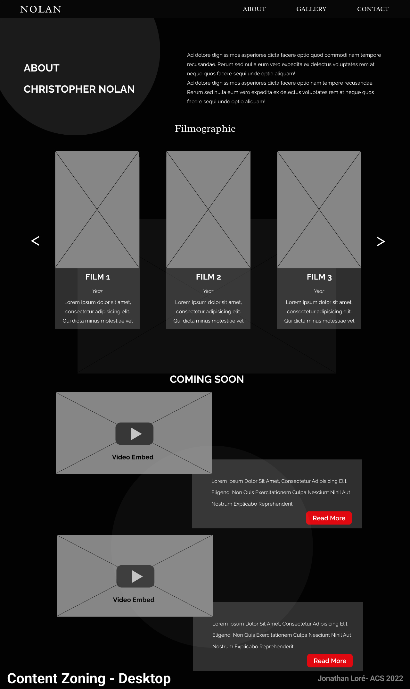
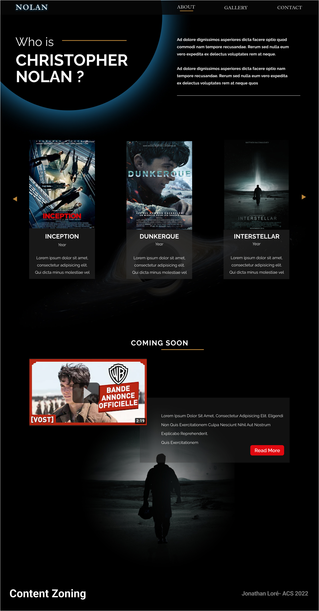

# Sommaire de la phase 1 

#### A.1 - [Analyse](##A.1.a)
#### A.2 - [Cahier des charges](##A.2)
#### A.3 - [Planche de tendances “moodboard”](##A.3)
#### A.4 - [Design System](##A.4)
#### A.5 - [Maquetter le Header](##A.5)
#### A.6 - [Zoning contenu principal](##A.6)
#### A.7 - [Maquetter le contenu principal](##A.7)
#### A.8 - [Maquetter le pied de page](##A.8)
#### A.9 - [Responsive](##A.9)

## A.1.a - Analyse
_Qui est Christopher Nolan ?_

**Christopher** _Jonathan James_ **Nolan** est un réalisateur, producteur, scénariste et monteur de cinéma britannico-américain.  
Il est né le 30 juillet 1970 à Westminster (Londres).

Il se fait connaitre par un premier long métrage, *Following* qui a été tourné en noir et blanc et dans lequel il endosse plusieurs casquettes, notamment celles de directeur de la photographie, scénariste et réalisateur.  
Le film est présenté en 1998 au festival du film de Toronto. 
Il remporte trois prix ce qui va lui permettre de se lancer dans la mise en scène du script présenté à Newmarket Films : _Memento_.  
Ce dernier a totalisé près de 40 millions dollars au box-office, c'est un grand succès.

Les films qui l'ont rendu célèbre par la suite sont _Memento_, _The Dark Knight_, _Inception_ ou encore _Interstellar_

Il est cofondateur, avec _Emma Thomas_  sa femme, de sa propre societé de production _Syncopy Films_.

## A.1.b - Identité visuelle
Son œuvre explore la moralité humaine. Elle se nourrie des préoccupations philosophiques, sociologiques ou éthiques, la construction du temps et la malléabilité de la mémoire et de l'identité personnelle.  

Sa societé de production Syncopy Inc. possède un logo :  

## A.1.c - Stratégie digitale
**Constat**   

Christopher Nolan ne possède ni site web ni réseaux sociaux, il a même dit qu'il n'utilisait pas de téléphone portable.  
Il ne déteste pas la technologie mais cela ne l'a jamais interessé et il interdit même l'usage des mobiles sur ses tournages.  
C'est son équipe qui s'occupe de gérer sa boite mail et sa femme qui gère toutes les affaires liées à leur maison de production : Syncopy Inc.

## A.2 - Cahier des charges

***JoAnisky*** est developpeur freelance. Son objectif est de rendre le web facile, moderne et accessible à tous.

**La cible du site web** :  
  Le grand public qui apprécie le cinéma.
  Tous les fans des films de Nolan et de la science fiction en général.

**État des lieux de l’existant**
   
  Nolan ne possède aucun site web mais on peut s'inspirer des sites d'autres réalisateurs.

**Arborescence du site**
  
  
  - Home >
  > News  
  > About
  - Gallery >
  > Images Gallery
  - Contact >
  > Contact form

**Description fonctionnelle**
  - Pop-up sur la page d'accueil pour abonnement à une newsletter.
  - Formulaire de contact.
  - Galerie.
  - Page login.
  - Page Backoffice.

## A.3 - Planche de tendance
> Pour faciliter le projet, tout le travail de recherche graphique (Benchmark, moodboard, maquettes etc...) est centralisé dans le fichier  Figma "moodboard.fig"
Disponible sur Github   [Benchmark/Moodboard Christopher Nolan](https://github.com/JoAnisky/christopher_nolan/blob/main/moodboard.fig  "Moodboard Christopher Nolan").

**Benchmark**

_Sources_ : 

[Spielberg Website](https://www.spielbergfilmarchive.org.il/ "Spielberg Website")

[Quentin Tarantino Website](https://www.tarantino.info/ "Quentin Tarantino Website")

[Zack Snyder Website](https://www.snydercut.com/ "Zack Snyder Website")

**Moodboard**

**Inspiration**

## A.4 - Design System

Github > [DesignSystem Christopher Nolan](https://github.com/JoAnisky/christopher_nolan/blob/main/moodboard.fig  "Moodboard Christopher Nolan").

## A.5 - Maquetter le Header
Proposition de design pour le header 
- Barre de navigation haute.
- Image de décoration qui récapitule les plus grands succès de Christopher Nolan. Effet "objectif" de caméra pour rappeller le cinéma.
-  Mise en avant du nom du réalisateur.
  

## A.6- Zoning contenu principal

 
## A.7 - Maquetter contenu principal

## A.8 - Maquetter le pied de page

## A.9 - Responsive
